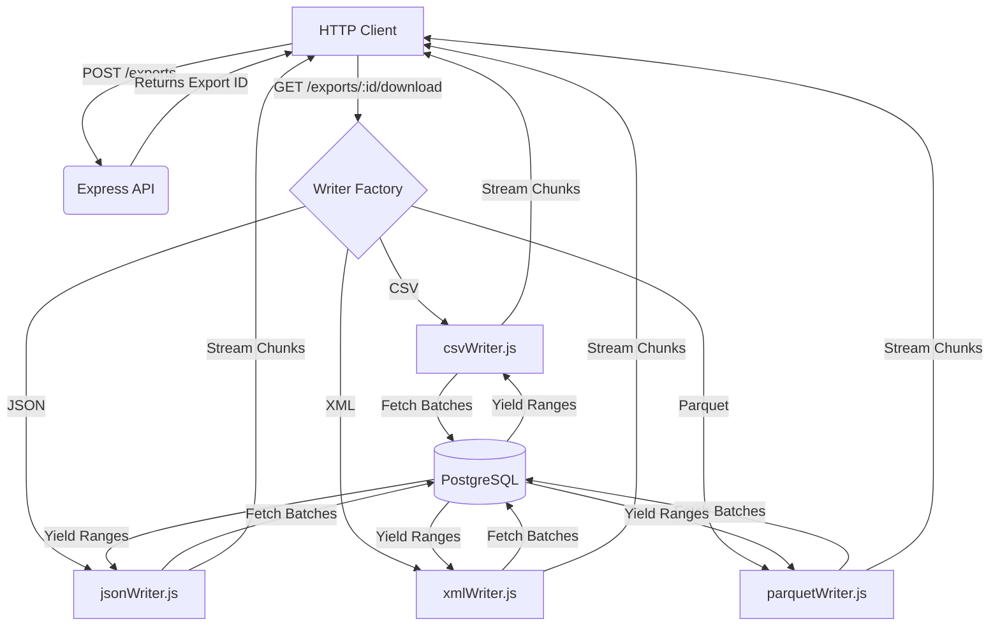

# Architecture Overview: Polyglot Data Export Engine

The Polyglot Data Export Engine is designed to solve a specific problem: **Exporting a massive dataset (10+ million rows) from PostgreSQL into multiple formats (CSV, JSON, XML, Parquet) while running in a highly constrained memory environment (256 MB hard limit).**

---

## 1. High-Level Architecture

The system is a Node.js (Express) application that connects to PostgreSQL and streams data directly to the HTTP response. It acts as a continuous pipeline rather than a batch processor.

---

## 2. Core Concepts & Constraints

### 2.1 Memory Constraint (256MB Limit)

Traditionally, ORMs or basic queries fetch the entire result set into Node.js heap memory before serializing. For 10 million rows, this requires gigabytes of RAM.

**Solution: Cursors & Generators**
We use `pg-cursor` combined with a JavaScript asynchronous generator (`async function* streamRows()`).

1. The engine asks PostgreSQL for a subset of rows defined by `DB_CURSOR_BATCH_SIZE` (default 500).
2. Once the batch is received, it is yielded to the formatter (CSV/JSON/XML).
3. The formatter writes the serialized chunk to the Node.js HTTP Response Stream.
4. The memory holding those 500 rows is freed for Garbage Collection.
5. The process repeats until the cursor is exhausted.

### 2.2 Format-Specific Implementations

Each export format has a dedicated writer module in `src/writers/` that consumes the row generator.

- **CSV (`csvWriter.js`)**: Uses the `csv-stringify` library. The writer pipes the async generator directly into the `csv-stringify` stream, which then pipes to the Express `res` object.
- **JSON (`jsonWriter.js`)**: Does not use a heavy library. It manually writes the opening bracket `[`, iterates through the generator stringifying each row and adding commas, and finishes with `]`. This guarantees zero buffer overhead.
- **XML (`xmlWriter.js`)**: Implements a lightweight, custom XML builder that escapes unsafe characters and recursively translates nested JSONB objects into XML tags on the fly.
- **Parquet (`parquetWriter.js`)**: Uses `@dsnp/parquetjs`. Because true streaming Parquet over HTTP is complex (Parquet requires column chunks and a file footer), we stream the rows into a temporary file in `/tmp/parquet-export/`. Once the file generation completes, the file is streamed via `res.download()` and then immediately deleted.

### 2.3 Compression

For text-based formats (CSV, JSON, XML), network bandwidth is the next bottleneck. The API supports on-the-fly `gzip` compression. We pipe the formatter output through Node's native `zlib.createGzip()` before piping it to the HTTP response, massively reducing the payload size with minimal CPU overhead.

_(Note: Parquet has internal Snappy compression, so gzip is disabled for Parquet exports)._

---

## 3. Database Layer

- **Connection Pooling:** Uses `pg` module's `Pool`. A single client is checked out exclusively for the duration of a cursor read.
- **Query Safety:** Column mapping is strictly validated against an allowlist before the SQL `SELECT` clause is built to prevent SQL injection.

## 4. Job Management

Jobs are tracked in an in-memory `Map` inside `src/jobs.js`.

1. Client requests an export, specifying format and columns.
2. Server validates, generates a UUID (`exportId`), and stores the configuration.
3. Client uses the UUID to trigger the download.

_In a clustered production environment, this Map would be replaced by Redis._
